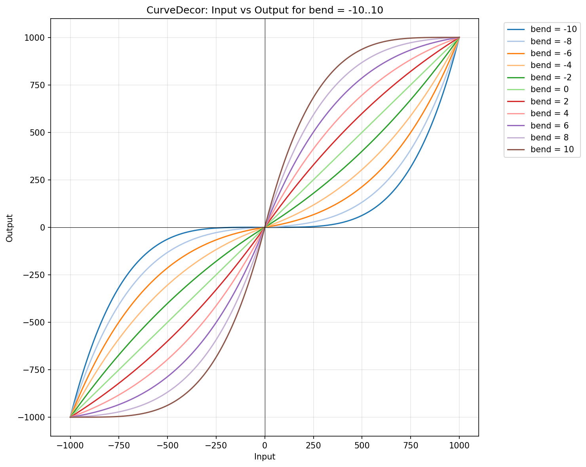

# Decorators

Decorators add behavioral features to motors by wrapping them. Multiple decorators can be stacked to combine features.

## CurveDecor – Non-linear Response

Converts linear input into an S-shaped curve. 



Applying to Motors: Negative bend values create a softer response at low speeds (finer control) with steeper response at high speeds. Positive bend values create sharper initial response with compressed high-end.

```cpp
template <class Motor, signed short kBend = 0>
class CurveDecor : public Motor
```

**Parameters:**

- `kBend`: -10..10 (0 = linear, positive = precise low-speed control, negative = aggressive start)

**Methods:**

- `SetBend(value)` – Set bend at runtime

- `Go(value)` – Apply curved transformation

**Example:**
```cpp
// Precise low-speed control with strong high-end response
using PreciseMotor = evam::CurveDecor<evam::DirectionalMotor<evam::TA6586Driver<9, 10>>, -6>;
PreciseMotor motor;
// Gentle reaction at low-speed
motor.Go(150);
motor.Go(200);
// Strong reaction at high speeds
motor.Go(750);  
motor.Go(800);
```

**Use cases:**

- Camera gimbals requiring smooth micro-adjustments

- Precision positioning systems

- Vehicles needing both crawling speed control and full power

- CNC machines with fine feed control

## InertiaDecor – Flywheel Effect

Simulates mechanical inertia where speed decreases gradually when stopping. Acceleration and direction changes are applied immediately, but deceleration follows an exponential decay curve.

```cpp
template <class Motor, unsigned short kInertiaMass = 10>
class InertiaDecor : public virtual Tickable, public Motor
```

**Requirements:**

Acording EVA principle must call `eva::tac()` in `loop()` to drive the deceleration updates.

**Parameters:**

- `kInertiaMass`: 1..200 (higher = slower deceleration)

**Methods:**

- `SetInertiaMass(value)` – Set virtual mass (1..200)

- `Go(speed)` – Apply speed with inertia simulation

**Example:**
```cpp
using InertialMotor = evam::InertiaDecor<evam::DirectionalMotor<evam::TA6586Driver<9, 10>>, 20>;
InertialMotor motor;
motor.SetInertiaMass(25);
motor.Go(800);  // Accelerate
motor.Go(0);    // Gradual deceleration
```

**Behavior:**

- Small mass (1-10): Quick stops, responsive

- Medium mass (11-30): Realistic car-like behavior

- Large mass (31-200): Heavy flywheel, slow deceleration

**Use-case:**

For extremely high transmission ratios (e.g., geared motors with high reduction), consider using higher inertia mass values to compensate for the mechanical advantage and gear train inertia.


## KickDecor – Static Friction Overcome

Applies a momentary power pulse when starting from stop or changing direction to overcome static friction and inertia.

```cpp
template <class Motor, unsigned short kKickDuration = 20, signed short kKickPower = 1000>
class KickDecor : public virtual Tickable, public Motor
```

**Requirements:** 

Must call `eva::tac()` in `loop()` to manage kick pulse timing.

**Parameters:**

- `kKickDuration`: Pulse duration in milliseconds (> 0)

- `kKickPower`: Pulse power (0..1000)

**Methods:**

- `SetupKickstart(duration, power)` – Configure kick parameters

- `SetKickDuration(value)` – Set pulse duration

- `SetKickPower(value)` – Set pulse power

- `Go(value)` – Apply with kick-start when needed

**Example:**
```cpp
using KickerMotor = evam::KickDecor<evam::DirectionalMotor<evam::TA6586Driver<9, 10>>, 30, 900>;
KickerMotor motor;
motor.SetupKickstart(25, 800);  // 25ms pulse at 80% power
motor.Go(300);  // Kick then maintain 30% power
```

**Kick Logic:**

- From stop to forward: Applies positive kick pulse

- From stop to reverse: Applies negative kick pulse

- Direction change: Applies kick in new direction

- Already moving: No kick, direct control

## Combining Decorators

Decorators can be stacked in any order to achieve complex behaviors:

```cpp
#include <evaTac.h>
#include <evamTA6586Driver.h>
#include <evamDirectionalMotor.h>
#include <evamCurveDecor.h>
#include <evamInertiaDecor.h>
#include <evamKickDecor.h>

using namespace eva;

// Stack all three decorators
using BaseMotor = evam::DirectionalMotor<evam::TA6586Driver<9, 10>>;
using PreciseMotor = evam::CurveDecor<BaseMotor, 5>;
using InertialMotor = evam::InertiaDecor<PreciseMotor, 15>;
using SmartMotor = evam::KickDecor<InertialMotor, 25, 900>;

SmartMotor motor;

void setup() {
    motor.SetupRange(-1000, -200, 200, 1000);
    motor.SetBend(6);
    motor.SetInertiaMass(20);
    motor.SetupKickstart(30, 850);
    motor.Go(800);  // All decorators applied
}

void loop() {
    eva::tac();
}
```

**Order Effects:**

- Curve before Inertia: Precise low-speed shaping, then inertia applied to smooth signal

- Inertia before Curve: Inertia on raw signal, then curve shapes the result

- Kick at any level: Always applied at appropriate layer

## Performance Considerations

- **InertiaDecor** and **KickDecor** require `eva::tac()` calls for timing

- All decorators add minimal overhead (inline templates)

- Multiple decorators compile to single optimized function chain

- No runtime polymorphism overhead
